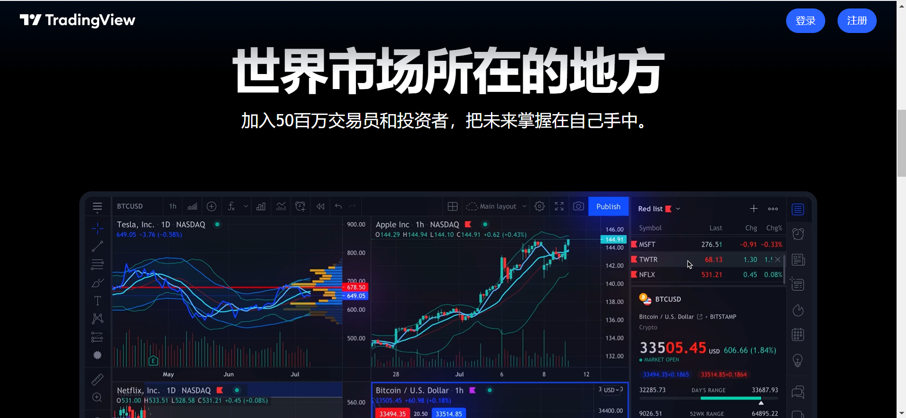

## 目录说明
~~~
api  php补充api
data 配置数据库
java-api-jar  后端java程序 
wap  手机前端
web  电脑前端
web_admin  总后台
web_agent 代理后台
sql  数据库文件
~~~

## 安装 
1. php 5.6, redis
2. 安装java端,设置域名
3. wap,web 设置好java  api域名，打包
4. data/config 设置数据库
5. 计划任务
6. 

### 计划任务
~~~

每1分钟
// 采集印度股票 https://trade.pgim.pro/api/cai_india_stock_list.php

访问URL[ https://trade.pgim.pro/api/getAliPrices.php ]	采集外汇	每隔1分钟执行

采集文章 > 印度 每天早上
// https://trade.pgim.pro/api/getNews.php

每1分钟
修复djzj  https://trade.pgim.pro/api/fix_djzj.php.php
~~~
可停用，因搜索会采集
~~~
每1分钟
// 采集印度股票 https://trade.pgim.pro/api/cai_india_index_list.php

访问URL[ https://trade.pgim.pro/api/cai_india_economictimes_list.php ]	采集股票	每隔1分钟执行

~~~

### api
php 补充api

1. nullPrice.php 检查持仓，无价格手动采集
    1. https://tradingdiario.com/api/nullPrice.php?op=list
2. 定时更新持仓中的价格
    1. https://tradingdiario.com/api/positonPriceUpdate.php
3. 删除多余价格
    1. 浏览器自动执行  https://tradingdiario.com/api/deleteRealData.php?op=auto
    2. 手动执行 https://tradingdiario.com/api/deleteRealData.php?op=list
    3. bt显示统计 https://tradingdiario.com/api/deleteRealData.php?op=list&from=bt
4. 新闻采集  https://tradingdiario.com/api/getNews.php
5. 新闻API  https://tradingdiario.com/api/getNewsList.php
5. 更新单个价格，进入详情时执行  https://tradingdiario.com/api/getMaStock.php
    6.  https://www.klsescreener.com/v2/stocks/chart/$code/embedded/1y 【失效】
    7.  https://www.shareinvestor.com/prices/searchbox_prices_f.html?counter=0021.MY 
    8.  备用
       9.  https://ws20.bursamalaysia.com/api/v2/stock_price_data?stock_code=0021.MY&mode=intraday&from_date=20230620&ws_a=80156f7b4453e622a9696997b207116ed2928cf3dc4a7719eaad19af3a90e034&ws_m=1687269357.0
       10.  https://api.wsj.net/api/dylan/quotes/v2/comp/quoteByDialect?dialect=official&needed=CompositeTrading|BluegrassChannels&MaxInstrumentMatches=1&accept=application/json&EntitlementToken=cecc4267a0194af89ca343805a3e57af&ckey=cecc4267a0&dialects=Charting&id=Stock-MY-0021
       11.  
6. 搜索并更新价格  https://tradingdiario.com/api/searchMaStock.php 【失效仅搜索】
    7. 'https://www.klsescreener.com/v2/stocks/all.json?term='.$code;【失败】
    8. https://www.bursamalaysia.com/api/v1/search/stock_list?keyword=0021&lang=EN&limit=99  无价格 
    9. https://www.shareinvestor.com/search/stocks_lookup?keyword=0021 无价格
    10. 
7. 首页推荐股票  https://tradingdiario.com/api/queryHomeIndex.php
8. 后台：挂单
    1. 列表   https://tradingdiario.com/api/pendingOrder.php?op=list
    2. 通过   https://tradingdiario.com/api/pendingOrder.php?op=prove&positionId=xxx
3. 7-6 
    4.新股 写入新股 https://tradingdiario.com/api/cloud_pass.php?code=0200&new_stock=1
5. 7-7
    6. 新股没有k线 通过搜索 更新价格 https://tradingdiario.com/api/cloud_pass_search.php?keyWords=5315 

### 支付api 
1. 666withdraw.php 提现
2. 666pay.php 支付api
3. 666notify.php 回调
4. 

## 官网
## 图片预览

